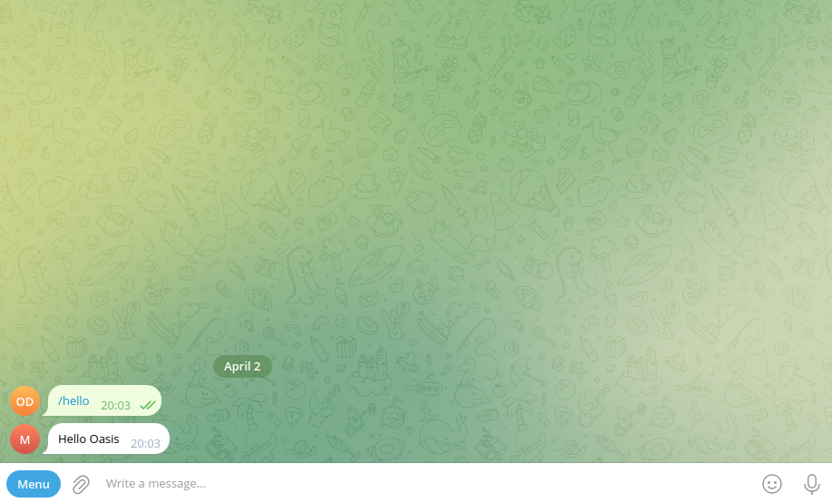
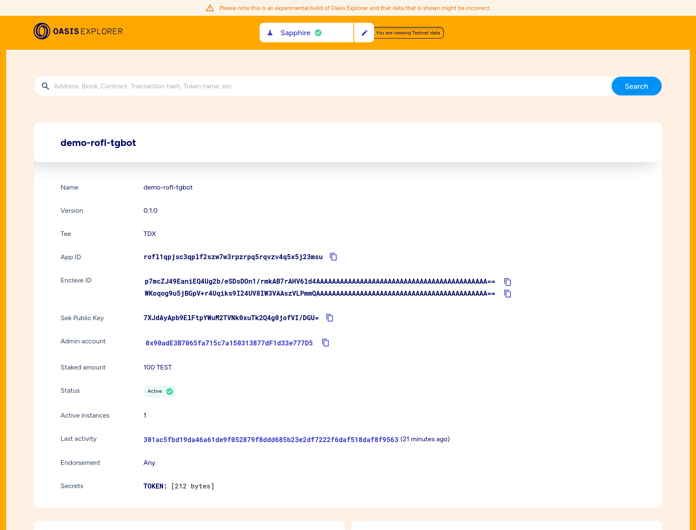

# Demo ROFL Telegram Bot

A simple Telegram bot running inside Oasis ROFL TEE deployed on the
[Oasis Sapphire Testnet chain]. Read the [Oasis ROFL Quickstart] to learn more.





[Oasis ROFL Quickstart]: https://docs.oasis.io/build/rofl/quickstart
[Oasis Sapphire Testnet chain]: https://explorer.oasis.io/testnet/sapphire/rofl/app/rofl1qpjsc3qplf2szw7w3rpzrpq5rqvzv4q5x5j23msu

## Run as a standalone bot app

```shell
pip install -r requirements.txt
TOKEN="0123456789:your_telegram_token" python bot.py
```

## Run inside docker

```shell
TOKEN="0123456789:your_telegram_token" docker compose up
```

## Run as a ROFL app

```shell
rm rofl.yaml

oasis rofl init
oasis rofl create
oasis build
echo -n "0123456789:your_telegram_token" | oasis rofl secret set TOKEN -
oasis rofl update
oasis rofl deploy
```
